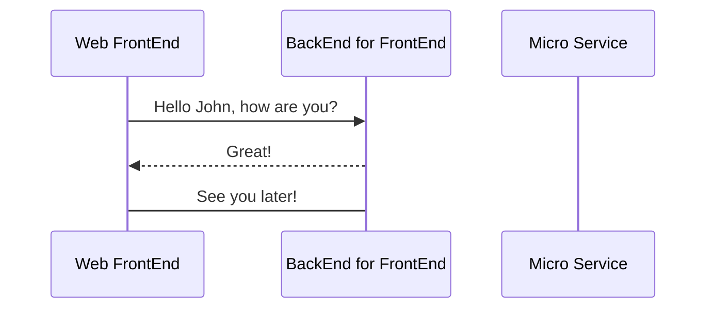

# Connect Go

## Architecture

### Sequnce


```mermaid
sequenceDiagram
    participant wf as Web FrontEnd
    participant bff as BackEnd for FrontEnd
    participant ms as Micro Service
    wf->>bff: Hello John, how are you?
    bff-->>wf: Great!
    wf->bff: See you later!
```

```
storage and bucket and tasks and database
```

## Directory


