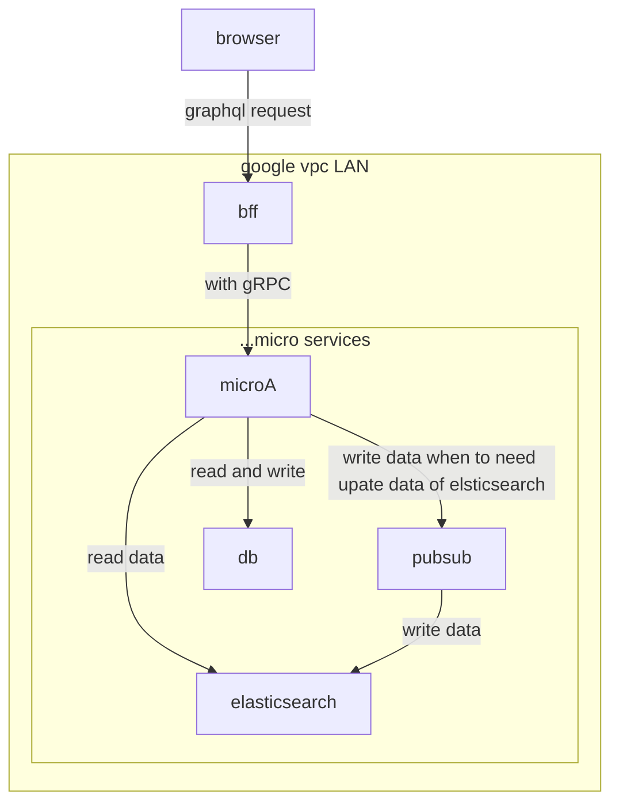

# application structure

## local developping

```mermaid
graph TB
    browser-- graphql request -->bff
    subgraph google vpc LAN
        bff-- with gRPC -->microA

        subgraph ...micro services
            microA--read data-->elasticsearch
            microA-- write data when to need upate data of elsticsearch -->pubsub
            microA--read and write-->db
            pubsub--write data-->elasticsearch
        end
    end
```

[elastic](https://www.elastic.co/guide/en/kibana/current/docker.html#docker-generate)
